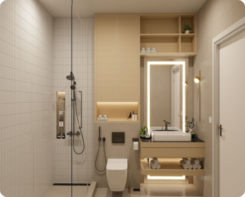

# Admin Dashboard

A modern admin dashboard built with React, Ant Design (antd), Tailwind CSS and some third party tools featuring article management and analytics visualization.

## Features

- **Article Management**

  - Display articles in Ant Design Table
  - Sort, filter, and paginate articles
  - Responsive design for all devices

- **Analytics Dashboard**

  - Interactive charts for earnings data in Earning Tabs
  - Data visualization with Recharts/Chart.js
  - Key metrics overview

- **UI Components**
  - Ant Design components integration
  - Tailwind CSS for custom styling

## Technologies Used

- ⚛️ React 19
- 🎨 Ant Design (antd) v5
- 🌀 Tailwind CSS v4
- 📊 Recharts/Chart.js (for charts)
- 🚀 Vite (build tool)
- 🔄 React Router v6
